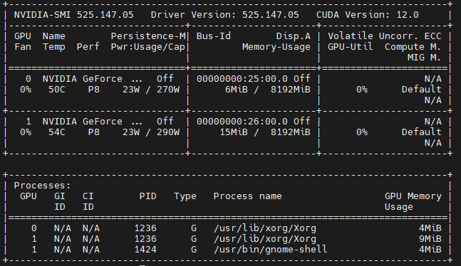

# MD-simulation-SETD2

## About :dna:
This repo contains python scripts used in Schnee et al. 2022 (doi: 10.1038/s42004-022-00753-w). This includes MD simulations code and analysis scripts. The usage of these Python scripts is further explained in the enclosed readme file.


## Installation :rocket:
The MD simulation production and analysis scripts were designed for ubuntu based NVIDIA GPU servers using the cuda toolkit (Version 12). Visit 

https://developer.nvidia.com/cuda-12-0-0-download-archive?target_os=Linux&target_arch=x86_64&Distribution=Ubuntu&target_version=20.04&target_type=deb_local

for installation instructions.

After installation, check for the correct set up by running

```
nvidia-smi
```
in your terminal.

The output should state the CUDA Version and driver version as displayed below



Best way to install packages is by using conda. Either install the full anaconda distribution (https://www.anaconda.com/) or the smaller footprint miniconda (https://docs.conda.io/en/latest/miniconda.html).

create a new conda environment (here named 'sim') by running

```
conde create -n sim
```

install the necessary packages by running

```
conda install conda-forge::openmm
conda install conda-forge::mdtraj
conda install conda-forge::pdbfixer
conda install -c conda-forge contact_map
conda install anaconda::openpyxl
```

## Citation :bookmark_tabs:

For the underlying MD data in the publication go to **doi.org/10.18419/darus-3263**.

Please cite **doi.org/10.18419/darus-2508** for the usage of this dataset.

Please cite **doi: 10.1038/s42004-022-00753-w** for the publication.
